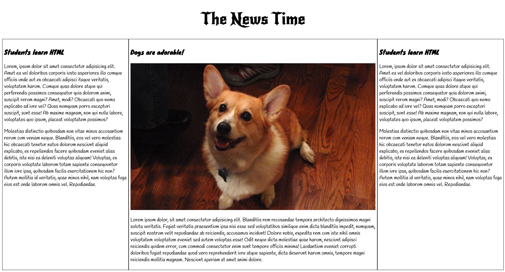

# Frontendmasters
> Current repository contains the project I've completed during the workshop.

### Project One
A sample news web page style. It has 3 sections. One is the first row and the news title. The second section is headline and recent news. And lastly, third section, the navbar and user's latest read article.

